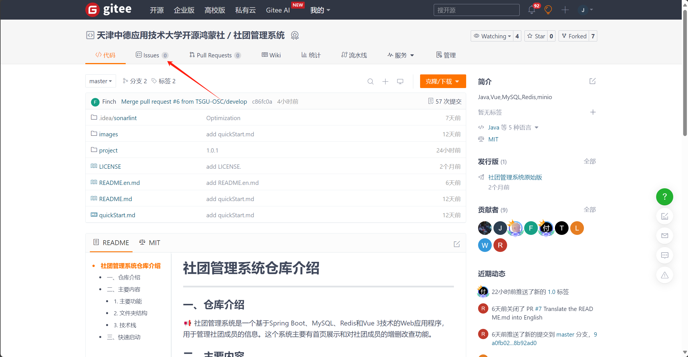
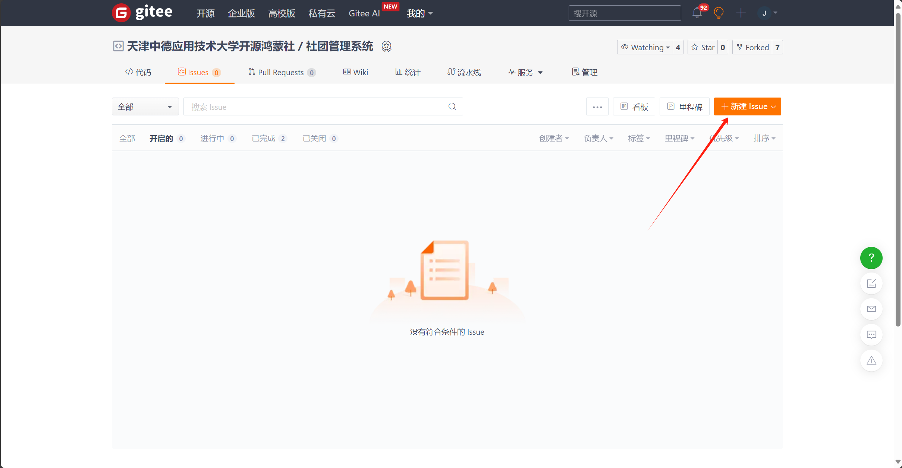
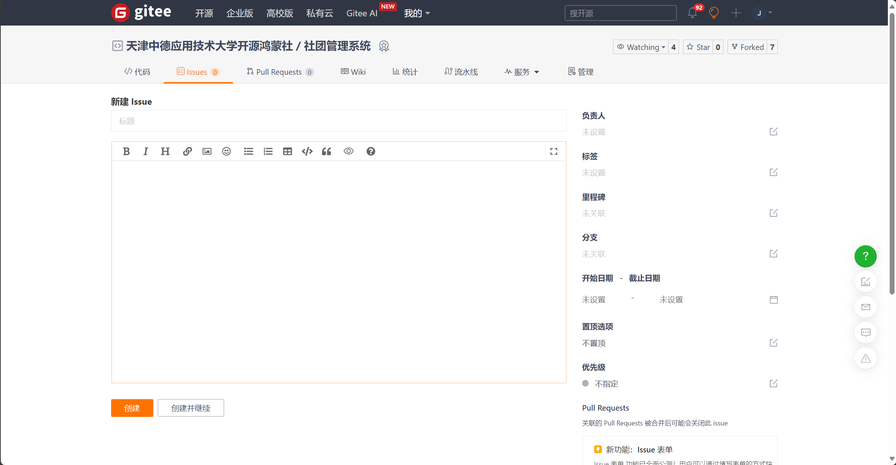
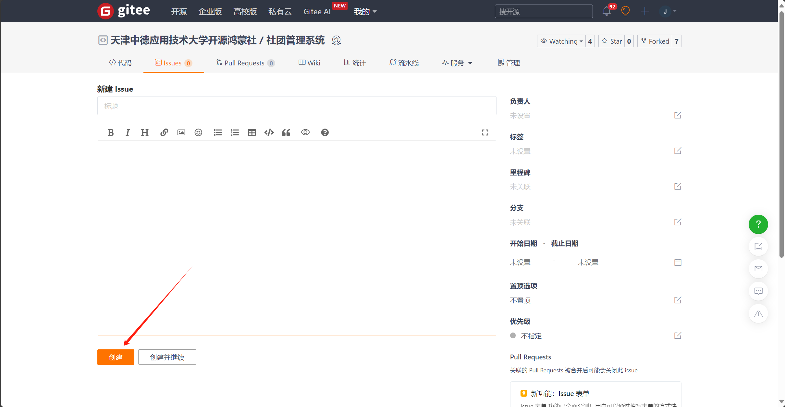

**如何提交issue**

在使用我们的社团管理系统过程中，如果您遇到了任何问题、发现了潜在的bug或是有任何改进建议，都可以通过提交issue的方式向我们反馈。以下是提交issue的基本步骤：

1. **找到项目仓库**

   在Gitee平台上，找到我们社团管理系统的项目仓库。链接：https://gitee.com/TSGU-OSC/management-system

2. **进入“问题”页面**

   在仓库的主页，您会看到多个选项卡，如“代码”、“issue”等。请点击“issue”选项卡，进入issue的管理页面。

   

3. **创建新issue**

   在问题的管理页面，您会看到一个“新建Issue”的按钮。点击这个按钮，开始创建新的issue。

   

4. **填写问题详情**

   在创建问题的页面，您需要填写以下几个关键信息：

   - **标题**：简明扼要地描述您的问题或建议。
   - **问题描述**：详细描述您遇到的问题或建议的具体内容。请确保描述清晰、具体，并尽量包含必要的细节和步骤，以便我们复现问题或理解您的建议。
   - **附件**：如果您的问题需要附上截图、日志文件或其他相关文件，可以通过附件功能上传。

   

6. **提交issue**

   完成上述信息填写后，点击页面底部的“提交”按钮，将问题提交给我们。

   

7. **等待回复**

   提交问题后，请耐心等待我们的回复。我们会尽快查看您的问题，并给出相应的解决方案或建议。

请注意，提交问题时请尽量保持礼貌和尊重，避免使用攻击性或侮辱性的言辞。我们非常欢迎您提出宝贵的建议和反馈，您的参与将帮助我们不断改进和优化社团管理系统。

感谢您的支持与合作！